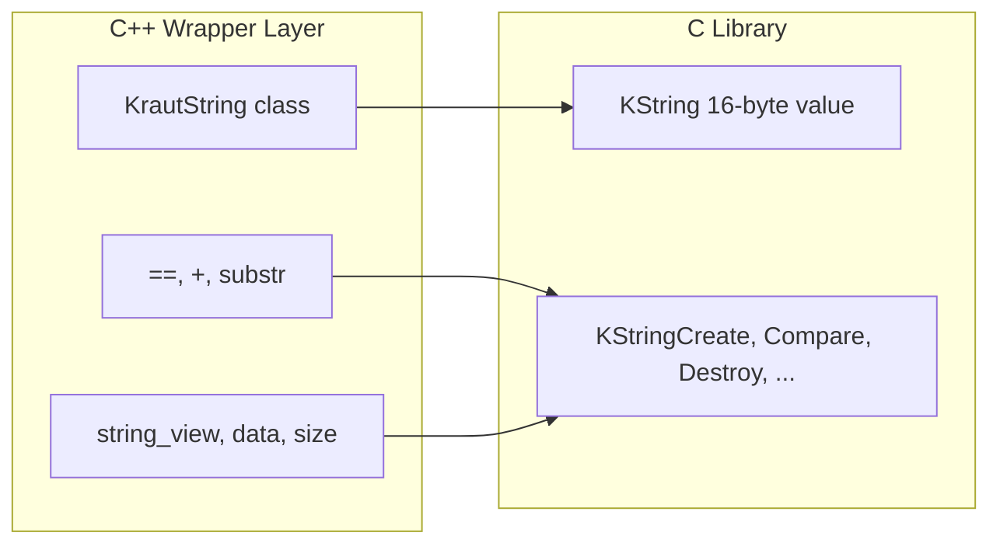

# KString C++ Wrapper — Design Plan

**Status:** Saved for later (June 6, 2026)  
**Decisions deferred:** repo placement (in-repo vs separate package)

---

## Context

The C library in [`include/KString.h`](../../include/KString.h) already exposes a C++-callable API (`extern "C"`, 16-byte `KString` passed by value). The core implementation is immutable, register-friendly, and optimized for comparisons — not mutation.

**Current project policy** ([`AGENTS.md`](../../AGENTS.md)): pure C only, no C++ in-repo. Placement (same repo vs separate package) is intentionally deferred; this plan focuses on *what* the wrapper should look like and *what problems it must solve*.



---

## Design Goal: B + C Hybrid

Prefer **ergonomic operators** plus a **std::string-like surface**. The wrapper should feel natural to C++ developers without pretending to be a full `std::string` replacement.

### What to adopt from std::string-like APIs

| Surface | Wrapper equivalent | Notes |
|---------|-------------------|-------|
| `size()` / `empty()` | `size()`, `empty()` | Delegate to `KStringSize()` — always O(1) |
| `data()` / `c_str()` | `data()`, `c_str()` | Delegate to `KStringCStr()` — see lifetime caveat below |
| `substr(pos, len)` | `substr()` | Delegate to `KStringSubstring()` |
| `operator==`, `<=>` | comparison operators | Delegate to `KStringEquals()` / `KStringCompare()` |
| `starts_with()` | `starts_with()` | Delegate to `KStringStartsWith()` |
| construction from literals | `KrautString("hello")` | Use `KStringCreatePersistentFromCStr()` for literals |

### What to add for ergonomics (beyond std::string)

| Feature | C backing | Rationale |
|---------|-----------|-----------|
| `operator+` | `KStringConcat()` | Natural concatenation, returns new owned value |
| `encoding()` | `KStringGetEncoding()` | Expose Kraut String encoding as scoped enum |
| `convert_to(Encoding)` | `KStringConvertToEncoding()` | Encoding-aware pipeline |
| `is_valid()` | `KStringIsValid()` | Surface C error model explicitly |
| `std::string_view` ctor | `KStringCreate()` with explicit size | Secure, non-`strlen` construction |

### What NOT to mimic from std::string

- **No in-place mutation** (`append`, `push_back`, `operator+=` on `*this`) — Kraut Strings are immutable; mutating APIs would allocate silently and fight the design.
- **No iterator over mutable chars** — read-only `string_view` bridge is enough.
- **No SSO/pointer split exposed** — `KStringIsShort()` can exist as `is_short()` for debugging/benchmarks, not as everyday API.

---

## Core Type: Value Wrapper, Not Handle

Recommended class shape:

```cpp
namespace kstring {

class KrautString {
    KString Value_;           // 16 bytes, trivially copyable
    bool    OwnsHeap_{false}; // C++-side ownership tracking
};

}
```

**Why not wrap a pointer?** The whole point of Kraut Strings is register-passing a 16-byte value. The C++ type should remain `sizeof(KString) == 16` plus minimal metadata — or stay exactly 16 bytes if ownership can be inferred.

### Ownership problem (critical)

`KStringDestroy()` in [`src/KString.c`](../../src/KString.c) only frees **long + TEMPORARY** strings. Storage class is **not exposed** in the public C API today.

| C factory | Storage class | Needs Destroy? |
|-----------|---------------|----------------|
| `KStringCreate` / `Concat` / `Substring` / conversions | TEMPORARY (long) | Yes |
| `KStringCreatePersistent` | PERSISTENT (long) | No |
| `KStringCreateTransient` | TRANSIENT (long) | No (but source must outlive use) |
| Short strings (any factory) | inline | No |

**Wrapper options:**

1. **C++ tracks ownership** (recommended): set `OwnsHeap_ = true` only when the wrapper created a TEMPORARY long string via owning factories. Move transfers the flag; copy clears it on the copy (shallow copy of persistent/transient is safe; deep copy of temporary requires new allocation via C API).
2. **Add C API** `KStringGetStorageClass()` or `KStringNeedsDestroy()` — cleaner long-term, keeps C++ thin, benefits other language bindings.
3. **Always-owning wrapper** — always call `KStringCreate` (never persistent/transient), always destroy. Simplest RAII, but loses zero-copy persistent literal optimization.

**Recommendation:** Option 1 now, with Option 2 as a small C API addition before v1.0 of the wrapper.

### Move / copy semantics

- **Move:** transfer `Value_` + `OwnsHeap_` (trivial, no refcount)
- **Copy of temporary long string:** must allocate a new C string (no C copy API today — would need `KStringClone()` or re-create from `KStringCStr()`)
- **Copy of persistent/transient/short:** bitwise copy of 16 bytes, `OwnsHeap_ = false`

This is the biggest gap vs `std::string`: cheap copy is not universally safe. Document clearly or add `KStringClone()`.

---

## Lifetime Caveat: `c_str()` / `data()`

`KStringCStr()` uses **thread-local rotating buffers** for short strings ([`src/KString.c`](../../src/KString.c) ~line 377). Implications for C++ API:

- `c_str()` is fine for immediate use, dangerous to store pointer
- Prefer returning `std::string_view` built from `KStringCStr()` + `KStringSize()` with documented invalidation rules
- Do not cache raw `const char*` across other `KStringCStr()` calls on the same thread

---

## Error Handling

C API returns `KStringInvalid()` — no exceptions. C++ options:

| Approach | Pros | Cons |
|----------|------|------|
| `bool is_valid()` + invalid sentinel | Matches C, zero overhead | Caller must check |
| `std::expected<KrautString, Error>` (C++23) | Modern, explicit | Heavier, not all projects on C++23 |
| Throw on invalid | Familiar to some C++ devs | Fights C library philosophy |

**Recommendation:** default factories return `KrautString` with `is_valid()`; provide `try_create(...)` returning `std::expected` as optional ergonomic layer.

---

## Suggested Public API Sketch

```cpp
namespace kstring {

enum class Encoding { Utf8, Utf16Le, Utf16Be, Ansi };

class KrautString {
public:
    // Construction
    KrautString() noexcept;
    KrautString(std::string_view sv);                    // owning (KStringCreate)
    KrautString(std::string_view sv, Encoding enc);
    static KrautString literal(std::string_view sv);     // persistent (zero-copy long)
    static KrautString transient(std::string_view sv);   // non-owning view into sv

    // std::string-like
    size_t size() const noexcept;
    bool   empty() const noexcept;
    std::string_view view() const;                       // preferred over raw c_str
    KrautString substr(size_t off, size_t len) const;

    // Ergonomic
    KrautString operator+(const KrautString& rhs) const;
    bool operator==(const KrautString& rhs) const;
    auto operator<=>(const KrautString& rhs) const;
    bool starts_with(const KrautString& prefix) const;

    Encoding encoding() const;
    KrautString convert_to(Encoding target) const;
    bool is_valid() const noexcept;
    bool is_short() const noexcept;

    // Interop
    const KString& native() const noexcept;              // escape hatch

    ~KrautString();
    KrautString(KrautString&&) noexcept;
    KrautString& operator=(KrautString&&) noexcept;
    KrautString(const KrautString&);                     // see ownership rules
    KrautString& operator=(const KrautString&);
};

}
```

---

## C API Gaps to Resolve Before Implementation

1. **`KStringClone(const KString)`** — correct copy semantics for temporary long strings
2. **`KStringGetStorageClass(const KString)`** or **`KStringNeedsDestroy(const KString)`** — simplify RAII without C++ guessing
3. **Thread-local `c_str` documentation** — must appear in C++ wrapper docs prominently

---

## Placement Options (deferred)

| Option | Pros | Cons |
|--------|------|------|
| **Optional subdir in repo** (`cpp/`, `KSTRING_BUILD_CXX`) | Single release, easy CI matrix, consumers get both | Violates current AGENTS.md policy; CMake complexity |
| **Separate repo** (`kstring-cpp`) | Clean C/C++ boundary, independent versioning | Two repos to maintain, release coordination |
| **Header-only in repo** (`include/KString.hpp`) | Zero link step for C++ users | Ownership logic in header; still violates pure-C policy |

---

## Comparison to std::string (selling points)

- **16 bytes** on stack vs 24+ bytes + heap for most `std::string` implementations
- **Immutable** — thread-safe reads without locking
- **Prefix-optimized comparisons** — faster inequality checks for long strings
- **Trade-off:** every "modification" allocates a new string; no iterator mutability; ownership rules are subtler

---

## Next Steps (when ready to implement)

- [ ] Decide wrapper placement: optional in-repo target vs separate kstring-cpp repo vs header-only
- [ ] Evaluate adding `KStringClone` and `KStringNeedsDestroy` to simplify C++ ownership
- [ ] Prototype `KrautString` with `string_view` surface, operators, and RAII destroy logic
- [ ] Document `c_str`/thread-local and transient/persistent lifetime rules in C++ API docs
- [ ] Plan C++ test suite for move/copy/concat/literal/transient ownership paths
